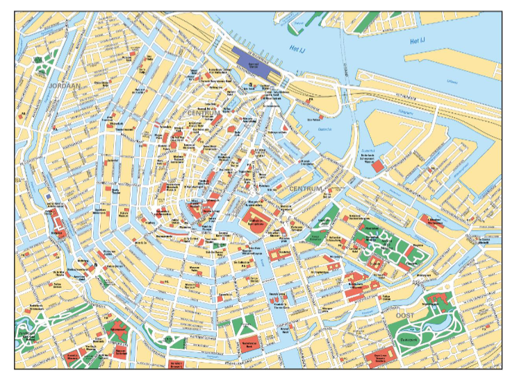
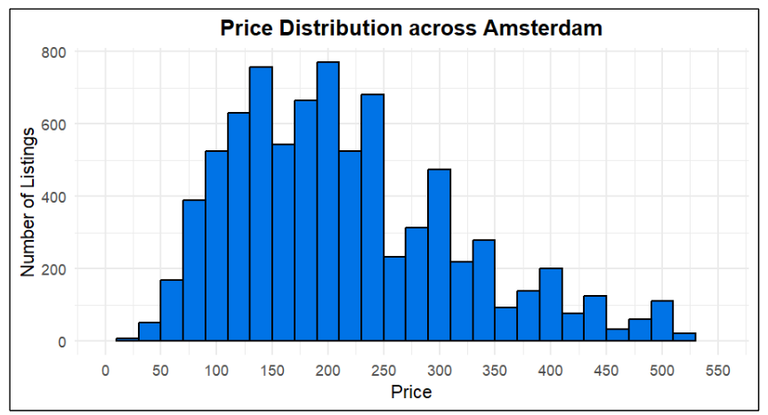
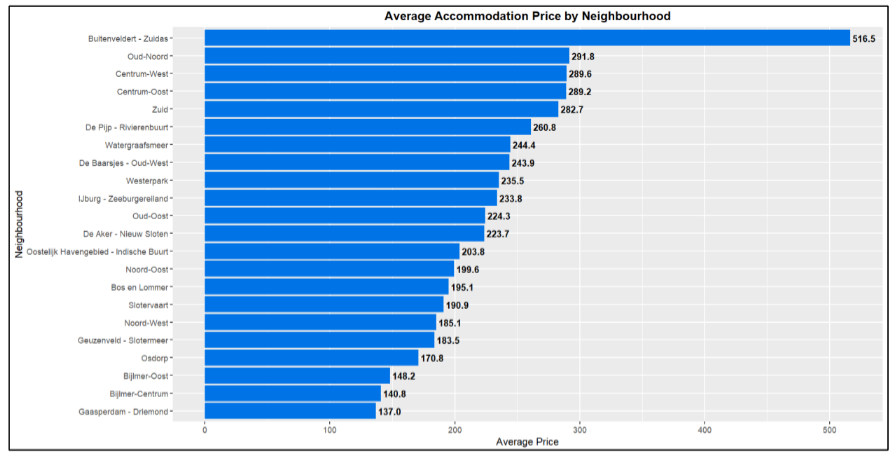

# 🏨 Amsterdam Affordable Accommodations Analytics  
> Data-Driven Insights for Low-Income Families with Infants  

---

## 📌 Executive Summary  

This project analyses **Airbnb accommodation data for Amsterdam** to identify **affordable, accessible, and family-friendly lodging options** for **low-income families travelling with infants**.

Using **R-based data analysis and visualisation**, the study evaluates **pricing, neighbourhoods, and property types** to uncover **structural gaps** in Amsterdam’s short-term rental market.

The analysis reveals a **severe shortage of suitable accommodation in the $50–$150 per night range**, creating strong opportunities for **Bed & Breakfasts, low-cost apartments, and budget private rooms** designed specifically for families.

---

## 🔎 Problem Context  

Amsterdam is one of Europe’s most visited cities, attracting **over 16 million tourists annually**.  
However, limited hotel capacity and rising rental prices make it increasingly difficult for **low-income families with infants** to find suitable accommodation.

While platforms like **Airbnb** provide thousands of listings, affordability, safety, and accessibility remain major barriers for families with limited budgets.

This project asks:

> **How can Amsterdam’s accommodation market better serve low-income families through data-driven insights?**

---

## 🎯 Objectives  

- Identify **affordable price ranges** for low-income families  
- Analyse **property type availability**  
- Compare **neighbourhood-level prices**  
- Detect **market gaps for family-friendly housing**  
- Provide **business-ready recommendations**

---

## 📂 Dataset  

- Source: **Inside Airbnb – Amsterdam**  
- File: `listings.csv.gz`  
- Size: **8,739 listings × 46 variables**

Key variables used:
- Price  
- Neighbourhood  
- Property Type  
- Room Type  
- Review Score  
- Location Score  
- Minimum Nights  

---

## ⚙️ Methodology  

The analysis was conducted in **R Studio** and followed this workflow:

1. Data cleaning and filtering  
2. Missing-value and outlier handling  
3. Price distribution analysis  
4. Property type categorisation  
5. Neighbourhood price comparison  
6. Visualisation and insight generation  

Design-thinking **empathy mapping** was used to align the data with the real needs of **families travelling with infants**.

---

## 📊 Key Analyses & Insights  

### 1️⃣ Tourist Activity & Demand Concentration  

Most tourism activity and accommodation demand is concentrated around **Amsterdam Centrum**, especially **Centrum-West and Centrum-Oost**, close to museums, transport, and major attractions.

This explains why prices are highest near the city centre.

---

### 2️⃣ Price Distribution Across Amsterdam  

The majority of listings fall between **$100 and $250 per night**, making Amsterdam unaffordable for many low-income families.

Only **0.71% of listings** are priced below **$50**, even though the ideal range for low-income families is **$50–$150**.

---

### 3️⃣ Property Type Availability (Fig-6)

| Property Category | Number of Listings |
|------------------|-------------------|
| Rental Unit | 4,113 |
| Condo / Loft | 2,018 |
| House | 1,592 |
| Hostel / Bed and Breakfast | 385 |
| Hotel / Aparthotel | 240 |
| Other | 164 |
| Boat / Houseboat | 149 |
| Apartment | 78 |

Rental units and condos dominate the market, while **apartments and Bed & Breakfasts — the most suitable options for families — are extremely scarce**, revealing a major supply gap.

---

### 4️⃣ Neighbourhood-Level Price Differences  

Some neighbourhoods, such as **Buitenveldert – Zuidas**, are extremely expensive, while others offer more affordable opportunities but with limited supply.

---

## 💡 Key Market Opportunities  

The data highlights strong opportunities to:

- Increase **budget Bed & Breakfasts with private family rooms**  
- Develop **low-cost, infant-friendly apartments**  
- Convert **unused canal boats into affordable houseboats**  
- Remove **minimum-night restrictions** on private rooms  
- Promote affordable housing **outside the city centre**

---

## 🏗️ Business Value  

This project enables:

- **Hospitality operators** to identify unmet demand  
- **Investors** to target high-impact affordability gaps  
- **City planners** to improve inclusive tourism  
- **Families** to find safer and more affordable stays  

---

## ⚠️ Limitations  

- Only Airbnb data was used  
- Prices are snapshot-based  
- Some values contained missing data  
- External factors (e.g., COVID-19) may affect pricing  

---

## 🛠️ Tools & Technologies  

- **R Studio**  
- ggplot2, dplyr, tidyr  
- Data visualisation & descriptive analytics  

---
