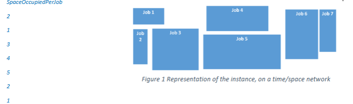
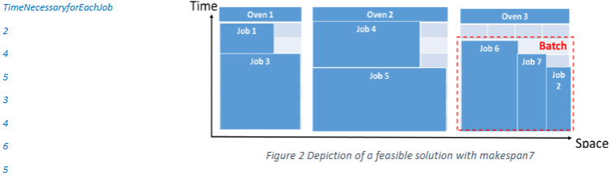

# 📦 Industrial Oven Scheduling using Heuristics & Metaheuristics  
> Makespan Minimisation for Batch Processing in an Industrial Bakery  

---

## 📌 Executive Summary  

This project solves a **real-world industrial scheduling problem** from a bakery in Iran, where biscuit trays with different **cooking times and space requirements** must be scheduled across **multiple ovens with limited capacity**.

The objective is to **minimise the makespan** — the total time required to complete all baking jobs — while ensuring that **oven capacity constraints** are never violated.

To achieve this, the project develops:
- A **custom constructive heuristic**
- **Local search neighbourhoods**
- A **metaheuristic optimisation strategy**

Together, these algorithms produce **high-quality oven schedules** that significantly improve production efficiency.

---

## 🔎 Problem Description  

Each job consists of biscuit trays that:
- Must be cooked together  
- Occupy a certain **space in the oven**  
- Require a specific **cooking time**  

Each oven has a **fixed capacity** and can process **multiple jobs simultaneously in a batch**, as long as total space does not exceed capacity.  
A new batch can only start when all jobs in the current batch finish.

The goal is:

> **Schedule all jobs into oven batches such that the final completion time (makespan) is minimised.**

This is a classic **NP-hard parallel batch scheduling problem**.

---

## 🎯 Objectives  

- Design a **constructive heuristic** to build feasible schedules  
- Implement **local search operators** to improve solutions  
- Apply a **metaheuristic** to escape local optima  
- Compare solution quality using **makespan**

---

## 📂 Input Data  

Each problem instance provides:
- Number of ovens  
- Oven capacities  
- Number of jobs  
- Space required by each job  
- Cooking time for each job  

A provided **VBA macro** reads the instances and evaluates feasibility and makespan.

---

## ⚙️ Solution Approach  

1. Generate an initial schedule using a **constructive heuristic**  
2. Improve it using **local search neighbourhoods**  
3. Apply a **metaheuristic** to explore better solutions  
4. Evaluate schedules using the **makespan objective**

---

## 📊 Key Visualisations  

### 1️⃣ Problem Representation  
**Time–space network of jobs**

This figure shows how each job occupies **space in the oven** over **time**, illustrating the complexity of overlapping space and duration constraints.

---

### 2️⃣ Feasible Oven Schedule (Makespan = 7)  

This figure shows a **valid batching solution** across three ovens, where multiple jobs are packed into batches without exceeding oven capacity.

---

## 💡 Business Value  

This optimisation framework helps manufacturers:

- Increase **oven utilisation**
- Reduce **total production time**
- Lower **energy and labour costs**
- Improve **throughput and scheduling reliability**

It applies directly to:
- Food production  
- Industrial ovens  
- Chemical batching  
- Any capacity-constrained manufacturing process  

---

## ⚠️ Limitations  

- Job times are assumed fixed  
- No machine breakdowns  
- No setup or cleaning times  

---

## 🔮 Future Extensions  

- Stochastic job durations  
- Energy-aware scheduling  
- Dynamic job arrivals  
- Multi-objective optimisation (cost + time)  

---

## 🛠️ Tools & Technologies  

- **Excel VBA**  
- Heuristic & Metaheuristic optimisation  
- Custom feasibility & makespan evaluation  

---
