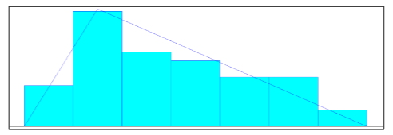
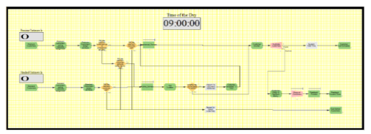

# 📞 Call Centre Simulation & Performance Optimisation  
> Discrete-Event Simulation using Arena  

---

## 📌 Executive Summary  

This project models and analyses the operations of a **small-scale call centre** using **Arena simulation software**. The system handles **two types of customers (Premium and Standard)**, multiple **server types**, **server breaks**, and a **feedback analysis process**.

The simulation is used to evaluate:
- Waiting times  
- Server utilisation  
- Customer satisfaction  
- Escalation handling  

Based on the results, the model is enhanced by introducing an **Expert Server**, leading to **improved waiting times and system efficiency**.

---

## 🔎 Problem Context  

Call centres must balance:
- Customer demand  
- Staff availability  
- Priority handling  
- Break schedules  
- Service quality  

Premium customers require faster service and may be escalated to experienced servers, while standard customers are handled by rookies. Long waits can lead to **call abandonment (balking)**, which hurts customer satisfaction.

The challenge is:

> **How can call-centre staffing and routing be optimised to minimise waiting time and improve service quality?**

---

## 🎯 Objectives  

- Build a realistic **Arena simulation model**  
- Analyse **queueing performance and utilisation**  
- Compare **current vs improved system design**  
- Quantify the impact of **adding an Expert Server**  
- Provide data-driven operational recommendations  

---

## 📂 Model Overview  

The simulation includes:

- **Customer types**
  - Premium  
  - Standard  

- **Server types**
  - 2 Experienced servers  
  - 3 Rookie servers  
  - 1 Expert server (recommended model)  

- **Customer behaviour**
  - Waiting tolerance  
  - Balking  
  - Escalation from rookie to experienced  

- **Feedback processing**
  - Alan & Mary analyse 15 feedback forms at a time  

---

## ⚙️ Simulation Setup  

- Software: **Arena**  
- Simulation length: **9:00 AM – 5:00 PM**  
- Replications: **40**  
- Arrival, service, and tolerance distributions estimated using **Input Analyzer**

---

## 📊 Key Model Visuals  

### 1️⃣ Feedback Analysis Distribution  

---

### 2️⃣ Initial Arena Model  

---

### 3️⃣ Improved Arena Model with Expert Server  

---

## 📈 Performance Comparison (Table 2)

| Metric | Initial Model (a) | With Expert Server (b) |
|-------|------------------|-----------------------|
| Avg waiting time – rookie queue (mins) | 0.02095 | 0.02051 |
| Avg waiting time – experienced queue (mins) | 0 | 0 |
| Avg rookie server utilisation | 31.40% | 30.00% |
| Avg experienced server utilisation | 11.50% | 11.50% |
| Avg waiting time – premium customers (mins) | 0.00846 | 0.00763 |
| Avg waiting time – standard customers (mins) | 0.02401 | 0.02401 |
| Avg time in system (mins) | 4.900 | 4.912 |
| Calls escalated to experienced servers | 4.35 | 4.35 |
| Customers who balk | 0.025 | 0.025 |
| Utilisation of Alan & Mary | 5.40% | 5.42% |

The improved system shows **lower premium waiting time and better workload balance**, while maintaining stability across all performance measures.

---

## 💡 Business Impact  

The simulation demonstrates how:
- Priority-based routing improves **customer experience**  
- An Expert Server reduces **bottlenecks**  
- Data-driven staffing improves **service quality**  
- Queue monitoring enables **operational control**  

These insights apply directly to:
- Customer support centres  
- IT service desks  
- Banking & telecom call centres  

---

## ⚠️ Limitations  

- Fixed arrival and service distributions  
- No agent learning effects  
- No real-time re-routing  

---

## 🔮 Future Enhancements  

- Dynamic staffing  
- Skill-based routing  
- AI-driven call prioritisation  
- Customer satisfaction optimisation  

---

## 🛠️ Tools & Technologies  

- **Arena Simulation Software**  
- Input Analyzer  
- Discrete-event simulation  
- Statistical performance analysis  

---
