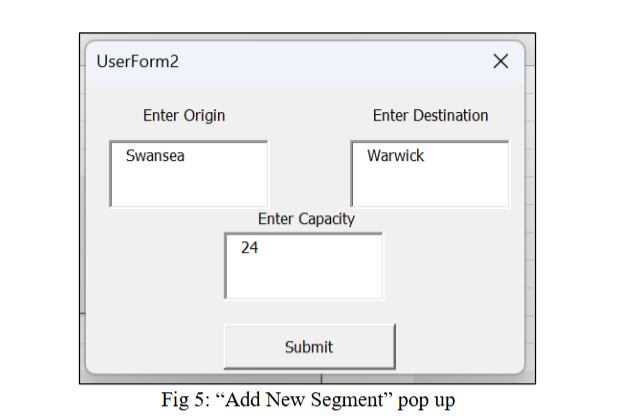
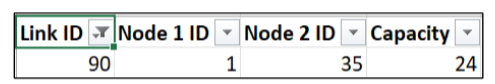
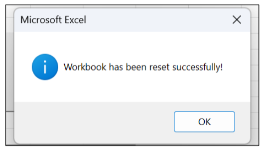
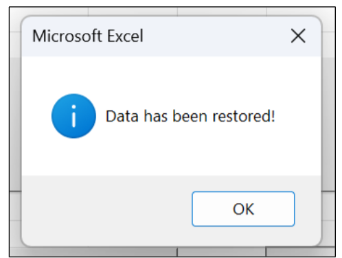

# 🚆 Railway Network Optimisation & Decision Support System  
> Capacity Planning using Ford–Fulkerson Algorithm (Excel & VBA)

---

## 📌 Executive Summary  

This project builds a **decision support system for railway route planning** using the **Ford–Fulkerson maximum flow algorithm** implemented in **Excel (VBA)**.

The system helps **route managers** optimise **train capacities between stations**, allowing them to:
- Identify bottlenecks  
- Adjust segment capacities  
- Restore and reset operational data  
- Test different routing scenarios  

Five real railway routes were simulated to validate system performance, demonstrating how **network flow optimisation** can improve **passenger movement and resource utilisation**.

---

## 🔎 Business Context  

Great Western Railway (GWR) faces challenges such as:
- Capacity constraints  
- Uneven passenger demand  
- Route congestion  
- Lack of real-time decision tools  

This system answers:

> **How can rail networks dynamically allocate capacity to maximise passenger throughput?**

---

## 🎯 Objectives  

- Model a railway network as a **flow graph**  
- Apply **Ford–Fulkerson algorithm** to compute maximum flow  
- Build an **interactive Excel-based decision support system**  
- Enable:
  - Route capacity changes  
  - Segment creation  
  - Data backup & restore  
- Validate the model using **real station routes**

---

## 📂 System Features  

The Decision Support System provides:

- **Add New Segment**
- **Reset Workbook**
- **Restore Workbook**
- **Route testing & capacity optimisation**
- **User alerts and validation messages**

---

## 🖥️ User Interface & System Screens  

### Add New Segment  

### Segment Added  

### Reset Workbook  

### Restore Workbook  

---

## 🚦 Trial Routes Analysed  

The system was tested on five real rail journeys:

| Trial | Route |
|------|------|
| 1 | Swansea → Cardiff Central |
| 2 | Swansea → Gatwick Airport |
| 3 | Bath Spa → London Paddington |
| 4 | Brighton → Bath Spa |
| 5 | Swansea → Oxford |

Each trial calculated the **maximum number of passengers** that could be transported based on network capacity.

---

## ⚙️ Core Algorithm – Ford–Fulkerson  

The system uses the **Ford–Fulkerson algorithm** to compute **maximum flow** between two stations.

It:
1. Finds available paths from origin to destination  
2. Determines the minimum residual capacity  
3. Pushes flow through the path  
4. Updates the network  
5. Repeats until no path remains  

This guarantees optimal use of the railway network.

---

## 🧠 Assumptions  

- Input station data is correct  
- No major network disruptions  
- Network topology is fixed  
- System uptime is stable  
- Technology stack does not change during execution  

---

## 💪 Strengths  

- Interactive feedback & alerts  
- User-friendly error handling  
- Real-time capacity changes  
- Algorithm-driven decision making  
- Efficient use of rail resources  

---

## ⚠️ Limitations  

- Sensitive to data quality  
- Uses only Ford–Fulkerson (single algorithm)  
- No real-time weather or outage data  
- Requires trained users  
- Limited external data integration  

---

## 📈 Business Value  

The system enables:
- Better route scheduling  
- Reduced congestion  
- Improved passenger flow  
- Data-driven rail management  
- Strategic planning for capacity growth  

---

## 🛠️ Tools & Technologies  

- Microsoft Excel  
- VBA Macros  
- Ford–Fulkerson Algorithm  
- Network Flow Optimisation  
- Decision Support Systems  

---

## 📎 Appendix – Data Structures  

### NodeInfo Structure

| Field | Description |
|------|-------------|
| nodeID | Unique station ID |
| stationName | Name of station |
| ParentNode | Parent in network |
| Connected | Is connected |
| Visited | Has been visited |
| ConnectingLink | Link ID |

---

### LinkInfo Structure

| Field | Description |
|------|-------------|
| linkID | Unique link ID |
| node1ID | First station |
| node2ID | Second station |
| capacity | Max capacity |
| flow | Current flow |
| ResCap | Residual capacity |

---

### Algorithm Variables

| Variable | Purpose |
|--------|--------|
| NodeFlag | Tracks current node |
| MinFlow | Bottleneck capacity |
| MaxFlow | Total flow |
| Current | Active node |
| NumConnected | Connected nodes |
| StopFlag | Algorithm termination |
